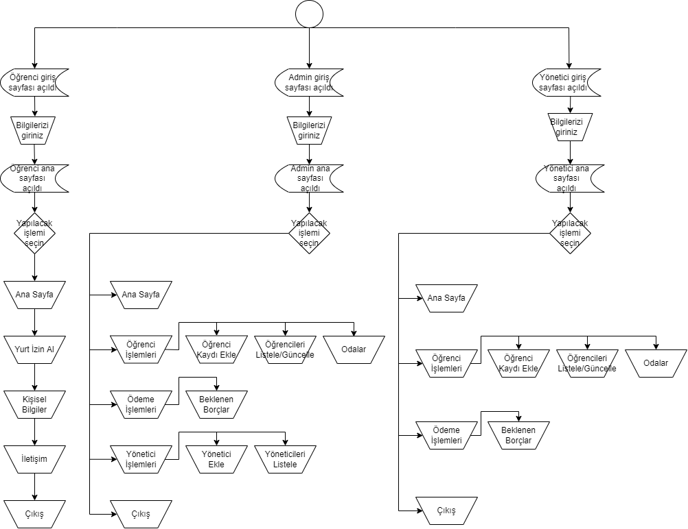
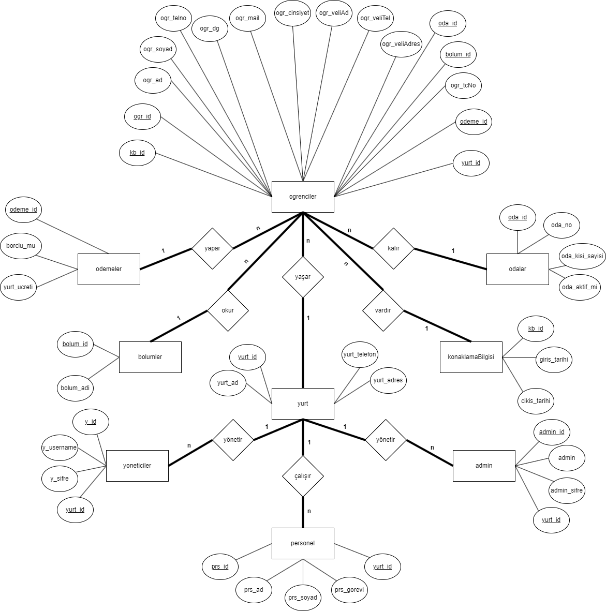

# dormitory_automation_codeigniter

https://github.com/MertGokyar
https://github.com/geokdeniz
# yurt otomasyonu projesi - veri tabanı yönetim sistemleri dersi
Günümüzde kişinin çeşitli nedenlerden dolayı yurtta kalması gerekebilir. Bunun için de doğal olarak yurt sahibinin bir otomasyona ihtiyaç duyması kaçınılmazdır. Web tabanlı sistemler bu sayede hayat kurtarır seviyededir. Projemiz için konuşacak olursak öğrenciler, bölümler,ödemeler, odalar, yönetici, super admin ve erişim kolaylığı gibi birçok seçeneğimiz bulunmaktadır. Bu seçeneklerde kendi içlerinde yapması gerekenleri içinde bulundurmaktadır. Yönetici kendi şifresi ve kullanıcı adı ile girdiği sistemde gereken her şeyi bulabilir ve istediği değişikliği yapabilir.

Bu projenin konusu olan yurt otomasyonu, zamandan tasarruf ettiren, yapılacak işlemleri zahmetsiz bir şekilde yaptırabilen bir amacı belirlemiştir. Yurda yeni kayıt olacak bir öğrencinin bilgilerini ve yurdun genel durumunu takip edebileceğimiz projemizi tanıtacağız.

Yurda kaydolacak öğrencilerin takip sistemini, yurdun genel durumunu, sistemde kayıtlı bulunan yöneticilerin de bu durumları kontrol etmesine, değiştirmesi vb. özellikleri güncellemesine olanak sağlayan bir web sitesidir. Uygulamamız admin, yönetici ve öğrenci girişi bulunduran bir giriş ekranıyla başlamaktadır.

# akış diyagramı

# ER diyagramı

